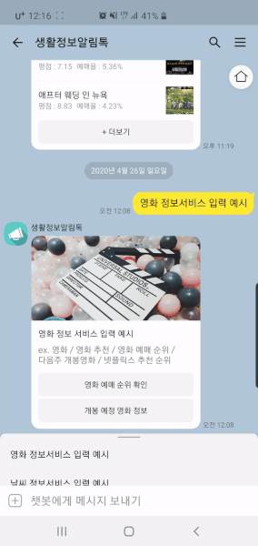

# ToyProject
* My Toy Projects for Work Efficiency (Design, Test, Analysis, etc.)  
------

## 1. PowerSupplyController
* VuPOWER 사의 programmable power supply인 K1205D을 이용한 솔레노이드 코일 시험용 프로그램  
* [상세설명](https://blog.naver.com/kamzzang1/221875003851)

#### A. 주요 기능
* 파워서플라이와 USB를 이용한 RS232 통신
* P1, P2 독립 제어 및 연동 제어
* CV, CC Mode 별도 지정
* 연속 작동, On/Off 반복 작동, 패턴(별도 CSV 파일) 작동
* 시험 중 전압, 전류 디스플레이
* 시험 완료 후 결과 파일 저장

#### B. 파이썬 패키지
pip install serial

#### C. 사전 설치 드라이버
* [RS232_USB드라이버](http://www.vupower.com/sub.php?page=demo.php)

#### D. 메뉴얼
* [K1205D 메뉴얼](http://www.vupower.com/download/K_USB_Manual_Korea_Ver3.2.pdf)

#### E. 실행화면

------

## 2. PatentSearch
* 특허 검색 사이트(WIPS ON)에서 원하는 키워드를 이용한 특허 검색 자동 크롤러  
[WIPS ON](https://www.wipson.com/service/mai/main.wips)  
------

## 3. OAScheduler
* 업무효율화를 위한 윈도우 작업스케줄러 생성 프로그램으로, 1차 특허 검색 작업 스케줄러 적용  

#### A. 주요 기능
* WIPS ON 아이디 비번 저장
* 한국, 미국, 유럽, 일본 특허 검색 가능
* 스케줄러 설정 : 매주 (각 요일 설정), 매월(월초, 월말)
* 저장하면 아이디, 비번, 검색국가 및 검색어는 "WIPS.csv"에 저장
* 설정한 일정 단위로 작업 스케줄러 "특허 검색" 등록  
  (기존 스케줄러에 "특허 검색"은 삭제 후 신규 등록)
  
#### B. 실행화면

------

## 4. KakaoChatbot
* Flask를 이용한 카카오톡 챗봇 제작으로 생활 편의를 위한 다양한 정보를 요청/응답할 수 있도록 함
* [카카오i오픈빌더 신청](https://blog.naver.com/kamzzang1/221922192463)
* [챗봇 시나리오 작성](https://blog.naver.com/kamzzang1/221926516530)
* [구름IDE 서버셋팅](https://blog.naver.com/kamzzang1/221934101918)
* [최종 마무리](https://blog.naver.com/kamzzang1/221934665928)

#### A. 주요 기능
* 영화 예매 순위, 개봉 예정작 정보 응답
* 날씨 정보 응답
* 길찾기 정보 응답

#### B. 실행화면

------

## 5. Macro
* 마우스 컨트롤
 * 마우스를 원하는 포인트에 위치하고 왼쪽버튼 클릭으로 위치를 저장을 반복함. 오른쪽 마우스 클릭 시 저장 완료
 * 마우스 클릭 후 인터벌 설정, 전체 반복 횟수 설정으로 매크로 시작됨
